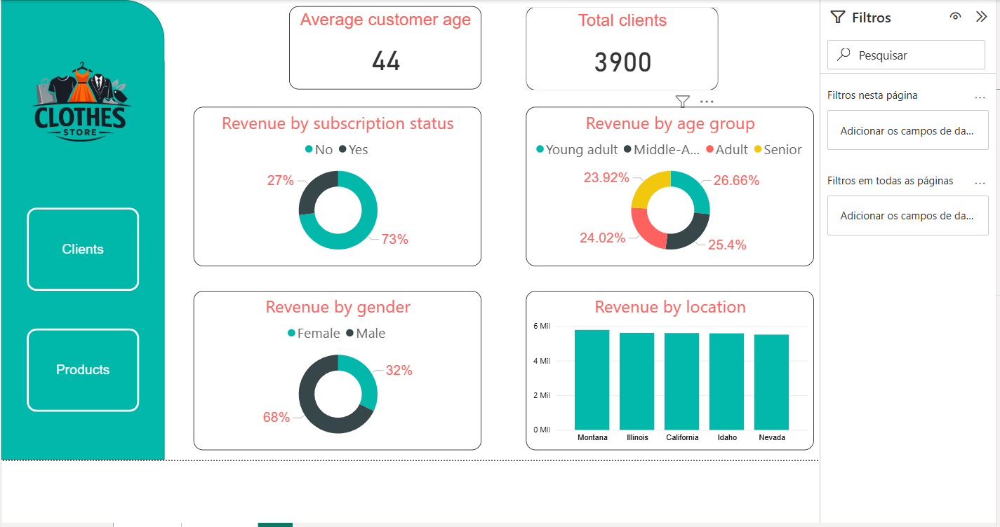

# 📊 Customer Behavior Analysis

Este projeto tem como objetivo analisar o comportamento de clientes utilizando uma abordagem baseada na **arquitetura medalhão (Medallion Architecture)**, com o uso de **SQL, Pandas e Power BI**.

## 📊 Dashboard Overview

---

## 🧱 Arquitetura Medalhão

A arquitetura medalhão organiza os dados em camadas progressivas de refinamento:

### 🥉 Bronze (Raw)
- Dados brutos, sem tratamento
- Fonte original do dataset

### 🥈 Silver (Tratado)
- Dados limpos e estruturados
- Tratamento de inconsistências, tipos e valores nulos

### 🥇 Gold (Refinado)
- Dados agregados e prontos para análise
- Contém KPIs e métricas de negócio

---

## 🔄 Pipeline do Projeto

O fluxo de dados segue a seguinte lógica:

1. **Raw → Silver**
   - Notebook: `raw_to_silver.ipynb`
   - Ferramenta: Pandas
   - Ações:
     - Limpeza de dados
     - Padronização de colunas
     - Tratamento de valores nulos

2. **Silver → Gold**
   - Notebook: `silver_to_gold.ipynb`
   - Ferramenta: SQL
   - Ações:
     - Criação de KPIs
     - Agregações
     - Resposta a perguntas de negócio

3. **Visualização**
   - Ferramenta: Power BI
   - Arquivo: `dashboard.pbix`

---

## 📁 Estrutura de Pastas

📁 customer_behavior
┣ 📂dashboard
┃ ┣ 📂images
┃ ┃ ┣ 📜logo.png
┃ ┃ ┣ 📜overview_2.png
┃ ┃ ┗ 📜overview.png
┃ ┗ 📜customer_behavior.pbix
┣ 📂data
┃ ┣ 📂gold
┃ ┃ ┣ 📜age_group_revenue.csv
┃ ┃ ┣ 📜average_purchase_shipping.csv
┃ ┃ ┣ 📜biggest_reneue_customer.csv
┃ ┃ ┣ 📜buyers_by_subscription.csv
┃ ┃ ┣ 📜discount_rate.csv
┃ ┃ ┣ 📜revenue_by_gender.csv
┃ ┃ ┣ 📜revenue_by_subscription.csv
┃ ┃ ┣ 📜top_3_items_category.csv
┃ ┃ ┣ 📜top_5_reviews.csv
┃ ┃ ┗ 📜types_of_customers.csv
┃ ┣ 📂raw
┃ ┃ ┗ 📜customer_shopping_behavior.csv
┃ ┗ 📂silver
┃   ┗ 📜customer_behavior.db
┣ 📂notebooks
┃ ┣ 📜raw_to_silver.ipynb
┃ ┗ 📜silver_to_gold.ipynb
┣ 📂sql_scripts
┃ ┣ 📜age_group_revenue.sql
┃ ┣ 📜average_purchase_shipping.sql
┃ ┣ 📜biggest_reneue_customer.sql
┃ ┣ 📜buyers_by_subscription.sql
┃ ┣ 📜discount_rate.sql
┃ ┣ 📜generate_import_sql.sql
┃ ┣ 📜revenue_by_gender.sql
┃ ┣ 📜revenue_by_subscription.sql
┃ ┣ 📜top_3_items_category.sql
┃ ┣ 📜top_5_reviews.sql
┃ ┗ 📜types_of_customers.sql
┗ 📜README.md

---

## 📌 Perguntas de Negócio Respondidas

Os scripts SQL foram desenvolvidos para responder questões relevantes, como:

- Receita por faixa etária  
- Valor médio de compra por método de entrega  
- Receita entre assinantes vs. não assinantes  
- Itens mais comprados com desconto  
- Receita por gênero  
- Maiores avaliações (reviews)  
- Segmentação de clientes (ocasionais, leais, compra única, etc.)  

---

## ⚙️ Tecnologias Utilizadas

- **SQL** → Geração de KPIs e consultas analíticas  
- **Pandas** → Tratamento e preparação dos dados  
- **Power BI** → Visualização e construção de dashboards  

---

## ⚠️ Observações

Este projeto representa uma implementação prática da arquitetura medalhão aplicada a um cenário de análise de clientes.

Ele não está finalizado e ainda possui espaço para melhorias, como:
- Otimização de queries
- Melhor modelagem de dados
- Expansão das análises

A prioridade foi manter o projeto **autoral**, garantindo entendimento completo de cada etapa do pipeline.

---

## 📈 Próximos Passos

- Refinamento da modelagem dimensional  
- Criação de métricas mais avançadas  
- Otimização de performance no SQL  
- Incremento de storytelling no dashboard  

---
